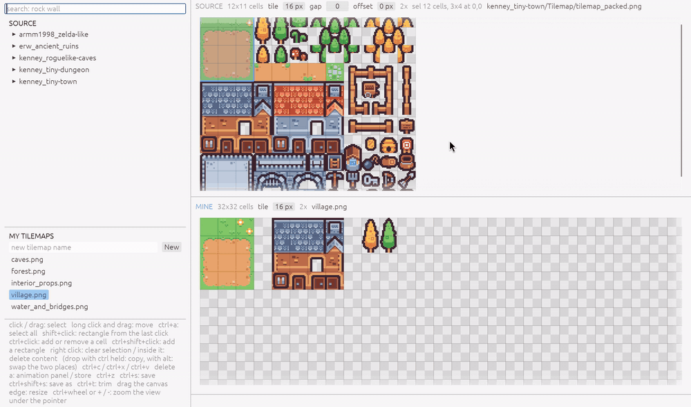
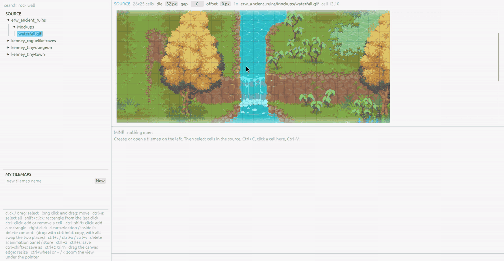
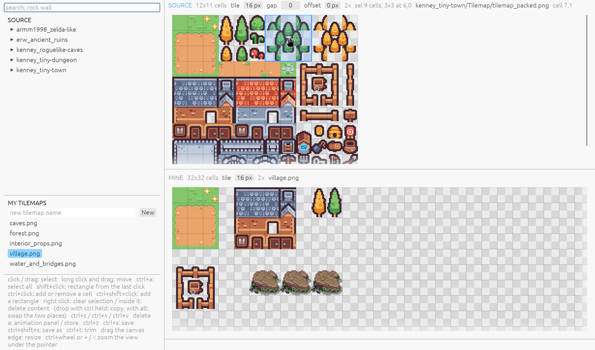

# Tilepicky

A small desktop tool to browse a large set of sprite sheets, search them, and
copy cells into tilemaps of your own. Each sheet has its own grid.

<https://github.com/spookysys/tilepicky>

That is the loop: open a tilemap of your own, search the packs for what the
map needs, select the cells, hold the button until they lift, and carry them
over. The sheets in the pictures are from [Kenney](https://kenney.nl) and
from [ArMM1998](https://opengameart.org/content/zelda-like-tilesets-and-sprites),
both in the public domain (CC0).

## The library and the project

Tilepicky works with two folders.

Your **library** holds the sheets and packs you collected. The tool only
reads it.

Your **project** holds the tilemaps you make. The tool writes them there,
with a `tilepicky.json` beside them.

Start the tool and it asks for neither. A panel that has no folder yet says
so; click anywhere in it and the folder dialog opens. The right-click menu of
each tree carries the same item, and it reads "Change" once a folder is set,
so you can point either side somewhere else and keep working. Both folders
are remembered for the next run, in
`~/.config/tilepicky/settings.json`.

You can also name them when you start the tool:

    cargo run --release -- [<library dir> [<project dir>]]

## Formats

The tool reads PNG, GIF, JPEG, WebP, BMP, and TGA. It writes one
format only: 32 bit RGBA PNG with straight alpha, which every engine reads.

An animated GIF plays in the library panel. When you copy a region that moves
between the frames, the frames unroll into one strip, marked as an
animation. A region that stands still gives one picture.

The scene in that picture is a mockup from the [Epic RPG World](https://rafaelmatos.itch.io/epic-rpg-world-collection)
packs by RafaelMatos, from a purchased copy.

## Layout

The left column holds the search box, the tree of your library, and the tree
of your project. The top panel shows the library sheet you opened. The bottom
panel shows the tilemap you are building.

## The grid

The header of each panel holds the grid fields. A sheet keeps its own values.

| Field | Meaning |
| --- | --- |
| tile | the size of one cell, `32` or `32x48` |
| gap | pixels between neighbouring tiles (Kenney sheets use 1) |
| offset | pixels before the first tile, `4` or `4x8` |

Every field takes the same three actions. Drag it left and right to step the
first number; one number moves as one, and a pair moves only its width. Turn
the wheel over it to step the second number, which splits `32` into `32x48`.
Click it to type any value. Each step applies at once, so the grid on screen
follows the pointer.

A library sheet stores a grid change in its book entry at once. A tilemap
keeps it until you save. A sheet with no entry of its own starts with the
tile size the folder used last, which the folder's own `tilepicky.json`
records; a folder that has never said one starts at 32 px.

## Keys

| Key | Effect |
| --- | --- |
| click | select one cell |
| drag | select a range of cells; near the edge of the view it scrolls |
| press and hold ~250 ms | lift the tile under the pointer, or the whole selection, and drag it |
| double click and drag | lift at once, without the wait |
| drag an edge of the selection | move that edge; out of the selection adds cells, into it removes them |
| shift+click | select the rectangle from the last clicked cell to this one |
| Ctrl+click | add or remove one cell |
| Ctrl+shift+click | add that rectangle to the selection |
| Ctrl+A | select the whole sheet |
| right click | clear the selection; inside the selection it clears the cells |
| Ctrl+C | copy the selection of the active panel |
| Ctrl+X | cut: copy, then clear the cells (your tilemap only) |
| Ctrl+V | paste at the selected cell of your tilemap |
| Delete | clear the selection in your tilemap |
| A | open the animation panel; again, store the animation or remove it |
| Ctrl+Z | undo |
| Ctrl+S | save |
| Ctrl+Shift+S | save as |
| Ctrl+T | trim empty columns on the right and empty rows at the bottom |
| drag the right or bottom edge of the canvas | resize your tilemap |
| Ctrl+wheel, + / - | zoom |
| Escape | clear the selection, or drop what you carry |

While you drag a block, two keys change what the drop does. Ctrl copies: the
cells it came from stay as they are. Alt exchanges the two places: what lies
where the block lands travels back to the place the block came from. A sign
in the corner of the block shows which one is in force. A block from the
library panel can only be copied, because the library never changes.

A drop on an empty tilemap panel starts a new tilemap. It takes the tile size
of the block you dropped, and it asks for a name at the first save.

Your tilemap is written when you save it. Undo stays available while the tool
runs.

## Files

Both trees answer the same actions. The project tree also changes files; the
library tree does not.

| Action | Effect |
| --- | --- |
| click | open the file |
| up, down | walk the files of the panel you last worked in, and open them |
| Enter | open the file the group ends on |
| shift+up, shift+down | grow the marked group in the project |
| Ctrl+click, shift+click | mark one file, or a range |
| drag across the files | mark every file the pointer crosses |
| press and hold ~250 ms, then drag | carry the file, or the marked group, into a folder |
| right click a file | rename, duplicate, delete; open its location; copy its path |
| right click a folder | new folder, rename, delete |
| right click the free space | new folder, refresh |

A carried file moves into the folder under the pointer. Hold Ctrl on the drop
to copy it instead. The book entry follows the file, and an open tilemap
keeps its identity when its own file moves. A name that the target folder
holds already is refused, and the other files still move.

"Open location" asks the desktop's file manager to show the file. "Copy
relative path" writes the path as you would type it in the directory where
tilepicky runs; "Copy absolute path" writes the whole path, with your home
directory as `~`.

## Search

Type words in the search box. The trees show only the files whose path holds
every word: a word matches when it is the prefix of a word in a file or
folder name. Search inside the tiles (captions, tags) is planned for a later
version.

## tilepicky.json

The library and the project each hold one `tilepicky.json`. It describes the
sheets in that folder: the grid (tile size, gap, offset), where the pixels
came from, and animations. The sheets are keyed by their path inside the
folder, and `tile` at the top is the size that folder used last.

    {
      "tile": 16,
      "sheets": {
        "kenney_tiny-town/Tilemap/tilemap_packed.png": {
          "animations": [
            { "px": [1280, 64], "frame": [64, 64], "frames": 6, "ms": 100 }
          ]
        },
        "village.png": {
          "tile": [32, 48],
          "provenance": [
            { "source": "kenney_tiny-town/Tilemap/tilemap_packed.png", "rects": [[96, 48, 96, 96]] }
          ],
          "animations": [
            { "px": [256, 32], "frame": [64, 64], "frames": [4, 2], "ms": 100 }
          ]
        }
      }
    }

A file written by an older version held the sheets alone, without the two
keys around them. Tilepicky reads that shape as well, and writes the new one
the next time it stores an entry.

A field with one number means both axes agree, except `frames`, where one
number means one row. For your tilemaps, the tool writes the entry on Ctrl+S,
together with the PNG. For a library sheet, a grid change or an animation you
store with `A` is written at once. The tool re-reads the file before it
writes an entry, so changes you make by hand survive.

## Tile sizes

A library sheet and your tilemap may use different tile sizes. A copy is pixel for
pixel: the block lands with its top-left on the target cell and is padded
with transparent pixels to whole cells. Provenance and animations are pixel
records, so the tile size does not touch them. Changing the tile size of a
sheet only changes the grid you see and the cells you can select.

## Your tilemaps

A tilemap is a `name.png` with its entry in `tilepicky.json`. `provenance`
lists, per source file, the pixel rectangles `[x, y, w, h]` of your tilemap
that came from it. Where in the source they came from is not recorded: the
source file answers that. In memory the tool keeps one source index per
pixel, so overwrites are exact; the rectangles are computed when you save.
The search box works on your tilemaps too, with the same rules.

## Animations

An animation is a block of frames on the bitmap, stored as
`{ "px": [x, y], "frame": [w, h], "frames": n, "ms": t }`. The frames play
left to right, then the next row down. `frames` is one number for a single
row, or `[columns, rows]` for a block; `6` is a strip of six, and `[4, 2]` is
eight frames in two rows.

Select the cells and press `A`. The animation panel opens on the right and
plays them. The frames field works like the tile field: drag it for the
frames in a row, turn the wheel for the number of rows, click it to type.
The frame size follows, so each number must divide its side of the selection.
The panel says so when it does not, and it stays open while you drag the
edges of the selection, until the numbers fit. Press `A` again, or the Store
button, to store the animation.

A stored animation travels with the block when you copy or drag it. When the
selection lies on a stored animation, the fields edit that one.

## Licence

Tilepicky is free software under the GNU General Public License, version 3 or
any later version. The whole text is in `LICENSE`.
