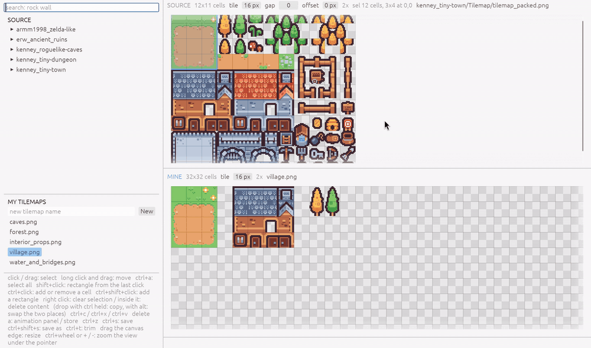
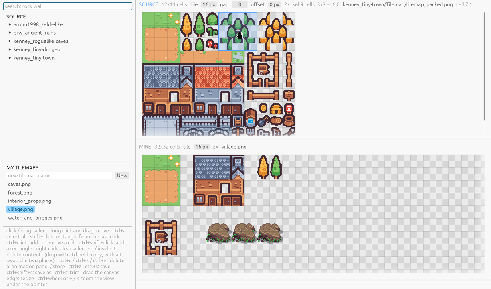
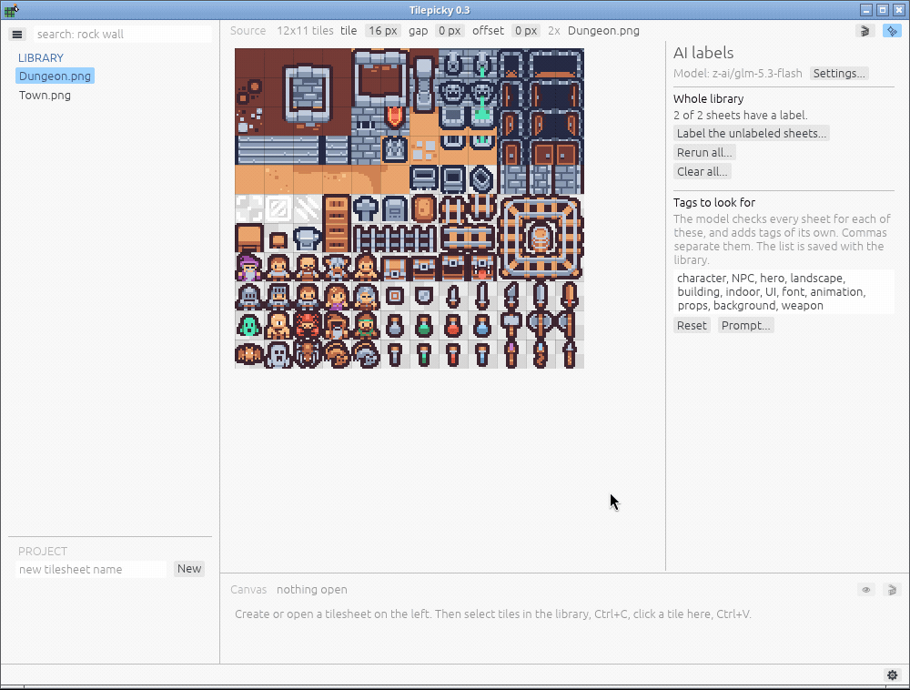
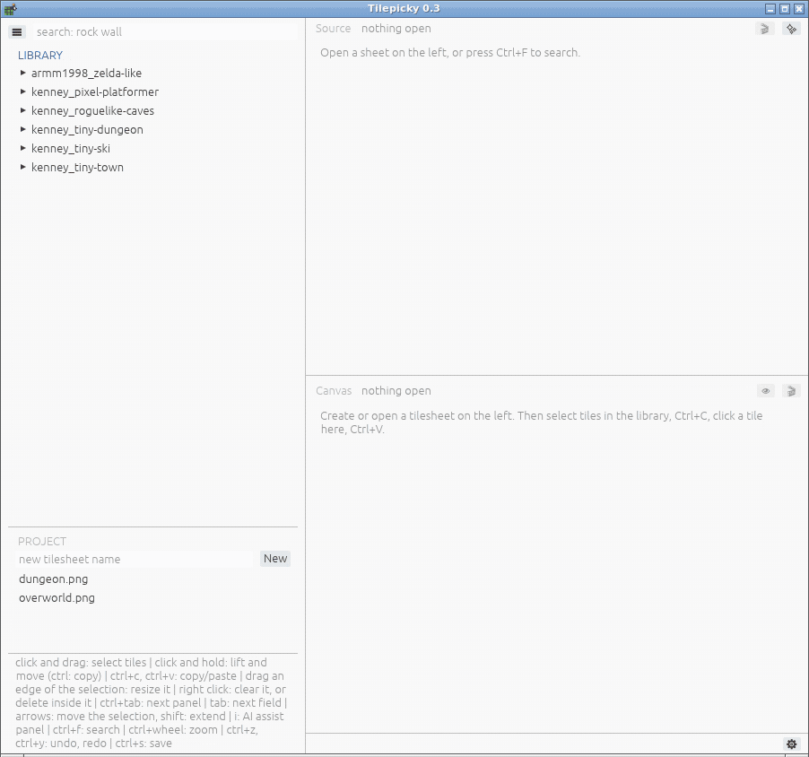
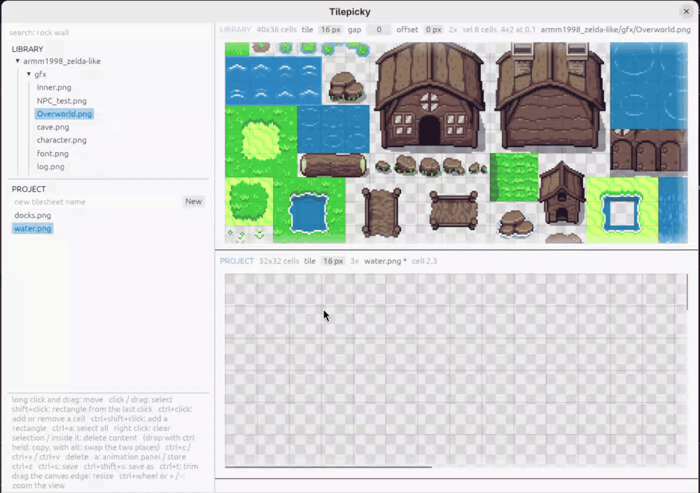
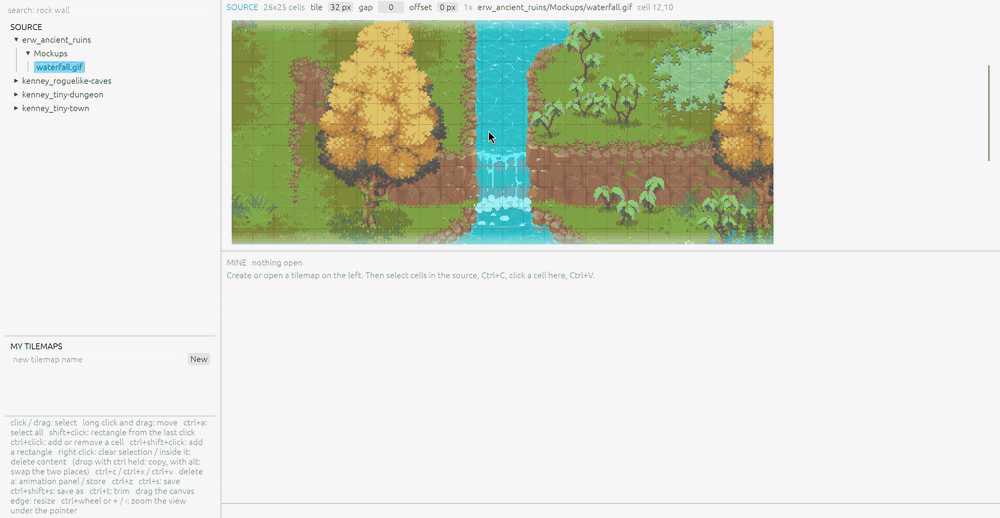

# Tilepicky

Tilepicky is a desktop tool to extract tiles from sprite sheets and assemble them into custom tilesets. You browse your sprite library, select tiles, and place them on an editable canvas.

<https://github.com/spookysys/tilepicky>

Open a project sheet, search the library for the tiles you need, select a region, and drag or copy the tiles onto the canvas.

## Library and project folders

Tilepicky organizes your work into two directories:

- **Library**: Holds your collected sprite sheets. Tilepicky treats this directory as read-only. It creates only a `tilepicky.json` metadata file to record grids, animations, and labels.
- **Project**: Holds the tilesheets you create and edit. Tilepicky writes output image files here, along with a project-specific `tilepicky.json`.

If you start Tilepicky without directory arguments, both panels prompt you to select a folder. You can change folders through the context menu in either file tree. Both paths are stored in `~/.config/tilepicky/settings.json`.

You can also pass paths as command line arguments:

    tilepicky <library dir> <project dir>

Source builds use OpenGL unless you enable WGPU. Builds with WGPU support, including release downloads, use WGPU by default.
Use `--glow` to select OpenGL, or `--wgpu` to select WGPU when available. To build with WGPU support from source, install with:

    cargo install tilepicky --features wgpu

## Install

Download binary releases for Linux, Windows, or macOS from the [releases page](https://github.com/spookysys/tilepicky/releases/latest). Extract the archive before running.

- On Windows, run `tilepicky.exe`.
- On Linux or macOS, run `./tilepicky` from the extracted directory. The macOS release supports both Intel and Apple Silicon hardware.

To install on Linux with desktop environment integration:

    install -Dm755 tilepicky ~/.local/bin/tilepicky
    install -Dm644 tilepicky.desktop ~/.local/share/applications/tilepicky.desktop
    install -Dm644 icon.png ~/.local/share/icons/hicolor/128x128/apps/tilepicky.png

The desktop launcher assumes `tilepicky` exists in your `PATH`. If your system cannot find the binary, update `Exec=` in `tilepicky.desktop` with the absolute path.

To compile and install from source, run:

    cargo install --locked --path .

## Layout

The window splits into two main columns:

- **Left column**: File trees. The library tree sits above, and the project tree sits below.
- **Right column**: Sheet viewports. The source sheet from the library sits above, and your project canvas sits below.

Each sheet viewport includes a header toolbar. The toolbar displays grid parameters (tile size, gap, offset), current zoom level, selection coordinates, sheet filename, and hover tile coordinates. Buttons on the right edge open side panels.

### Inspector mode (Eye)

Press `E` to toggle inspector mode on the project canvas. When inspector mode is active:

- Hovering over any tile displays a tooltip with the original source sheet path.
- All tiles derived from that same source sheet highlight across the canvas.
- Hovering over empty space displays general sheet properties.
- Selection and editing actions are disabled while inspector mode remains active.

## Search

The search input sits above the library tree. Press `Ctrl+F` to focus the search field.

Search matches query terms as prefixes against sheet metadata:

- Entering `gra` matches `grass`.
- Multiple terms require all words to match.
- The filter menu beside the input toggles target fields: folder names, file names, AI captions, AI tags, and embeddings (meaning).

The word fields are matched locally and synchronously on your machine. The embeddings field is a sibling of them, not a mode above them: a sheet shows when any enabled field matches. It needs an embedding index; see [Search by meaning](#search-by-meaning). Until the library has one, the checkbox matches nothing, the way an empty caption field does.

## Labeling sheets with AI

Tilepicky can generate searchable captions and tags for library sheets using multimodal vision models.

The recording shows an earlier layout with saved example labels. It shows the AI panel, **Show AI label...**, and a search for `weapon`.
The search finds the dungeon sheet through its tags. The recording sends no requests.

### Label a single sheet

1. Open a library sheet and click **Tags (AI)...** beside the source header.
   You can also choose **Generate Tags (AI)...** from the sheet or file-tree context menu.
2. Choose the **Single sheet** model and its provider key in Settings (`Ctrl+,`).
   Both Google Gemini and OpenAI-compatible image models are supported.
3. Click **Label this sheet**. The dialog shows progress, the result, or the error.
4. Use **Label again** to replace a saved label, or **Retry** after a failed request.
   Opening the dialog does not send a request.

The model returns a caption, freeform tags, and matching tags from your list. The prompt asks for at most the library's free-tag count, 16 by default; a reply that returns more is kept whole.
Tilepicky writes the label to `tilepicky.json`. The dialog shows the saved model separately from the next request's model.
Closing the dialog or pressing Escape keeps the request running. Click its status-bar entry to reopen it.
The dialog remains attached to its sheet when you select another sheet or library.
A failed or unlabelable replacement keeps an existing usable label. Results cannot overwrite an image or label changed during the request.

The sheet dialog and the library panel each have a **Copy log** button for their own job.
Copying shows **Copied** beside that button. A button stays disabled when the matching job has no log.
A saved label alone does not provide a request log.

Only one labeling job can run at a time. An outstanding batch also blocks single-sheet requests while paused.
Each library stores one current job log in `.tilepicky-ai-log.jsonl`, beside `tilepicky.json`.
A new job replaces that file, whether it labels one sheet or the library.
The sheet dialog's button refers to that dialog's target request. The library button refers to the library batch.

Finished jobs keep their log until you exit. Exiting removes finished logs and keeps unfinished logs.
Restarting a batch continues its log. An interrupted single-sheet request keeps its log for diagnosis and does not resend automatically.
On restart, that single-sheet job becomes a finished interruption. Its log remains available until the next exit.
Retrying sheets within a batch continues that batch's log unless another job has replaced it.

Logs include prompts, requested tags, model replies, parsed tags, timing, and errors. They exclude API keys and image data.
Each log keeps up to 2 MiB of recent entries. Copied logs report when earlier entries were discarded.
Sheet names and generated captions remain in the log. Older shared logs are removed when the updated app starts.

Each request times out after 60 seconds. **Cancel** stops waiting, but the provider may still bill the request.

To delete a label, select **Remove label...** in the sheet dialog and confirm.
**Current prompt...** shows what a new request for this sheet would send, including its current library tags and filename context.

OpenRouter settings have a **skip** field for provider slugs, separated by commas. It defaults to `phala`, including for older settings.
Clear the field to allow all providers. Single requests and library batches use this list.
A batch keeps the provider settings it started with.

New requests include the filename and library-relative folder as optional clues. They never include the absolute path.
The prompt tells the model to use visible content and treat names as data, not instructions.
Existing batches keep their original prompt and context policy. The request log includes the exact context sent.

GIF sheets submit their first frame. Images with dimensions exceeding 2048 pixels are scaled down before submission.

### Search by meaning

**Generate Embeddings (AI)...** turns each labeled sheet into one vector, so that search can match a query by meaning rather than by prefix. The button sits in the library AI panel and beside the source header, and also in the right-click menu of a library file or folder.

The caption and the tags of each sheet go to the embedding model. The images stay on this machine. The confirm names the model and the number of sheets before anything is sent.

The vectors live in `embeddings.json` beside the library, with the model that made them. Generating again embeds only the sheets whose label changed. A different embedding model re-embeds every labeled sheet.

Choose the **Embeddings** model in Settings (`Ctrl+,`). Only labeled sheets get a vector. OpenRouter serves embeddings through an OpenAI-style endpoint.

The **embeddings (meaning)** checkbox in the search filter then matches a sheet whose vector is close to the query's. It is a peer of the word fields. A sheet with no vector, or a library whose vectors came from another model, matches nothing by meaning.

With that checkbox on, the query text goes to the embedding model, once per settled query, so that Tilepicky can compare it. The word fields need no network.

### Label an entire library

To label multiple library sheets in bulk:

1. Open the library folder.
2. Open **Library AI labels** (`I`) and select **Label unlabeled sheets...**.
3. Choose the **Library** model under **Active models** and set its provider key in Settings. The initial selection is `~deepseek/deepseek-flash-latest` on OpenRouter.
4. Review the unlabeled sheet count and the tags to look for, then click **Start labeling**.

Use **Rerun all...** to label every sheet again with the current library model and tag list.
Review the request count and confirm with **Start labeling**. Existing labels stay until new results arrive.

To label part of a library, choose the sheets in the tree first.
Click a folder to choose every sheet below it, in its subfolders too; the chosen folder wears the selection colour. Right-click a folder and select **Generate Tags (AI)...** does the same.
To choose single files, Ctrl+click each one, then right-click one of them and select **Label N sheets with AI...**.
The panel names the target and offers **Label unlabeled in selection...** and **Rerun all in selection...**.
Use **Whole library** to clear the choice. A folder and loose files cannot share one selection.

The confirmation estimates the job's cost in USD before you start. **Estimate details** shows input and output token ranges and price sources.
It reads local image sizes and fetches OpenRouter's public model prices. It does not upload sheets to calculate the estimate.
Google estimates use a dated table of batch prices. The table expires instead of silently keeping old prices.
With **Sheet storage**, the OpenRouter estimate uses the batch rate, about half the live catalog price.
For `gemini-flash-latest`, the confirmation names its price assumption because the alias can change.
Unsupported models, expired prices, or a failed price lookup show an unavailable estimate. You can still start the job.

The range includes estimated image, prompt, response, and reasoning tokens. It is not a spending limit.
Without prior usage, output assumes 256 to 1536 tokens per sheet. Actual use can exceed that range.
For a matching fixed model and tag list, at least five reported requests from the previous job refine the output range.
Retries, taxes, route prices, and provider fees can change the final bill.
**Job cost estimate** retains the initial estimate and shows reported usage at those rates while the job runs.
The library book keeps the estimate and usage across restarts. Missing usage and unconfirmed requests are not included in reported usage.

Failed and unlabelable requests keep their old usable labels.

Use **Clear all labels...** to remove all saved AI captions and tags in the library, including its subfolders.
Confirm with **Clear all**. Images, grids, animations, and the list of tags to look for stay.
This cannot be undone. Wait for labeling to finish or cancel it before you clear labels or start another batch.

A batch keeps the tag list it started with, even if you change the list while it runs.

With an OpenAI-compatible provider such as OpenRouter, Tilepicky labels a library two ways. If the provider has **Sheet storage**, Tilepicky uploads each sheet to your bucket and submits one OpenRouter batch: it runs while Tilepicky is closed, and OpenRouter bills batch requests at about half rate. The sheets leave your machine only to that bucket, and Tilepicky deletes them when the batch finishes. Without storage, Tilepicky sends ordinary requests in the background, several at a time, and the app must stay open. OpenRouter's batch API accepts images only at public URLs, which is why storage is needed for a batch. With Google Gemini, Tilepicky submits requests through the Gemini batch API in batches of up to 100 sheets, and sends several batches at once. The full-height library panel displays progress and keeps job controls above the scrollable details. Completed labels are written directly to `tilepicky.json`. Some providers behind a model answer in prose instead of a label; such a sheet goes out again, up to three tries in all, and **Generate Tags (AI)** asks once more.

Google batch requests require an API key from a project with billing enabled. The Free tier does not support batches.
Tilepicky offers `gemini-flash-latest` for both scopes. This alias follows Google's latest Flash release, which can change.
The previously shipped Google default migrates to this alias. Existing jobs keep their saved model.
A model is a chat model or an embedding model. A chat model serves single sheets, library jobs, or both; the editor ticks each scope, and sets how many requests or batches a library job keeps in flight. An embedding model makes vectors for search and serves no sheet.
Library models show **OpenRouter batch**, **Several sheets at a time**, or **Google batch**, depending on the provider and its storage.
Not every batch provider can carry an image. A Google-batched model cannot, and its sheets end with a message that names the cause. Choose a Library model whose provider can carry images, or label those sheets one at a time with the Single sheet model.
Failures show their cause and a next step beside the job status. Billing errors link to Google billing when applicable.
API key errors offer a Settings button. Saved labels remain unchanged when a request fails.
Repeated errors appear once, with the affected sheet count. **Error details** keeps the full explanations and affected sheet paths.

When no newer message is visible, the status bar shows the outstanding batch's progress and state.
Click the batch status to open the AI pane and its controls.
A library failure keeps a status-bar notice, including after the job finishes. Click it to open the recovery actions.
A failed single-sheet request keeps a clickable notice while its current request log remains available.

The job view separates saved labels, provider work, unsent sheets, and uploads awaiting confirmation.
The progress bar counts finished outcomes, including failures and cancellations. **Labels saved** counts usable labels written to the library.
The main message distinguishes queued work, processing, and an unknown provider state. The last provider response, next check, and current request appear below it.
**Details**, or **Error details** after a failure, keeps the job's original tags and provider batch information available.

**Pause uploads** stops new submissions after the current request finishes. Tilepicky still collects accepted results.
For a provider that labels sheets one by one, the button is **Pause**. **Resume** continues the same job.
**Cancel job** stops new submissions. For a Google batch it asks Google to cancel accepted work, and the job stays visible as **Cancellation pending** until Google confirms an outcome.
An OpenRouter batch has no cancel call: Tilepicky stops waiting and releases the uploaded objects, but the batch may still finish at OpenRouter and bill. Its sheet labels are not collected. Saved labels stay.

Closing pauses local uploads and result collection. Google can continue work it has accepted.
Reopen the same library to continue. Pause and cancellation requests survive restart.
Each library has at most one outstanding job, stored under `ai_batch` in its root `tilepicky.json`.
The record includes progress, provider batch IDs, and pause or cancellation requests. API keys stay in the app configuration.
The job follows the library when you move the folder. Older configuration journals migrate automatically without another submission.
Only one Tilepicky window can own a library job at a time.

Tilepicky saves each submission's reference before sending it. A lost reply triggers an automatic lookup.
An uncertain submission stays separate while other work can continue. A submission that is out or awaiting confirmation counts against the model's number, so a flaky connection cannot pile up more paid work than the model allows.
When the lookup proves Google never made the batch, Tilepicky sends its sheets again on its own, so an interrupted upload resumes. **Retry unconfirmed sheets...** remains for a submission the lookup could not resolve, and explains the possible duplicate charge before a resend.
You do not need to find or attach a provider batch ID.

Network operations retry independently, with a delay of up to eight minutes after repeated failures.
A successful status check does not discard an upload or cancellation error. **Retry now** requests another attempt.
**Retry failed sheets** becomes available after a job finishes with failures.
A failed library write retries from stored results without another model request.
New jobs record the image and existing label before submission, so delayed results cannot silently replace newer work.

Single-sheet actions live in the sheet dialog. Library jobs live in the side panel.
The panel identifies its execution method as **Google batch**, **OpenRouter batch**, or **Several sheets at a time**.
A running job keeps its original provider, model, prompt, and tags.
Resume and retry also use the saved model. Changing Settings selects the model for new jobs.
The panel shows a notice when the saved job and Settings use different models.
To use the selected model, cancel the saved job or let it finish. Then choose **Label unlabeled sheets...**.
Saved labels stay. **Rerun all...** also replaces existing labels.
**Copy log** includes the current job summary and recent diagnostics, without keys or image data.

### Tags to look for

Open **Edit library options...** from the sheet dialog or the library panel.
Both links open the same form for their stated library. Separate tags with commas, then select **Save options**.
Changes apply to new requests in both scopes. Existing jobs keep their original tags.
The prompt asks the model to check each tag independently, including secondary content.
It asks for every matching tag, with the spelling from your list, and no duplicate synonyms.
The model can still miss visible content. These tags do not count toward the free-tag count the prompt asks for.

**Free tags per sheet** sets the most tags the model may add of its own, from 0 to 64. A new library starts at 16. The prompt only asks: a reply is kept whole even when the model returns more.

A new library starts with `character, NPC, hero, landscape, building, indoor, UI, font, animation, props, background`. **Reset tags** brings that list back. The list and the free-tag count belong to the library: Tilepicky writes them at the top of the library's `tilepicky.json`.

Each label records the list its request used. **Current prompt...** in the sheet dialog previews the next request.
**Prompt template...** in library options shows the shared text before each request adds its filename context.
The log contains the original request. The popup's current prompt can differ from that request. Changing the list does not relabel anything.
To apply the new list, select **Label again**, or remove the label and label the library again.

API keys are stored separately in `~/.config/tilepicky/keys.json` with restricted file permissions (`0600`).

## Keyboard navigation

Tilepicky supports complete operation using the keyboard.

In the recording, the arrows walk the library tree and open the Tiny Town pack. `Ctrl+Tab` moves to the source sheet, and `Shift` with the arrows selects a house. `Ctrl+C` copies it, and `Ctrl+Tab` into the empty canvas starts a new tilesheet, where `Ctrl+V` pastes it. Two trees follow the same way. `Ctrl+T` trims the canvas to what it holds, and `Ctrl+S` names and saves it.

### Pane and widget navigation

- `Ctrl+Tab` / `Ctrl+Shift+Tab`: Moves focus between pane bodies. Navigation cycles column by column: library tree, project tree, source sheet, project canvas, side panels, and status bar.
- `Tab` / `Shift+Tab`: Cycles through every interactive input and button in the same column order.
- `Ctrl+Tab` from the source sheet into an empty project canvas creates a new tilesheet initialized with that source tile size.
- The active pane displays a highlighted blue title.

### File tree controls

- `Up` / `Down`: Moves cursor between rows without opening files.
- `Right` / `Left`: Expands or collapses the selected folder.
- `Enter` or `Space`: Opens the selected file, or toggles folder expansion.
- `Shift+Up` / `Shift+Down` (Project tree only): Extends multi-file selection.

### Sheet controls

- `Arrows`: Steps the selection boundary in the pressed direction.
- `Shift+Arrows`: Expands or shrinks the selection rectangle.
- `Ctrl+Arrows`: Jumps cursor to the boundary of filled tiles or across gaps.
- `Alt+Arrows`: Moves the selection rectangle without moving tile contents.
- `Enter`: Begins editing a focused text field.
- `Escape` or `Enter`: Exits text field editing and returns keyboard control to the pane.

## Animations

You can define tile animations directly on a sheet:

1. Select a sequence of tiles.
2. Press `A` to open the animation panel and preview playback.
3. Set the `cell` parameter to specify frame size in tiles (such as `1x1` or `2x2`).
4. Set the `ms` parameter to configure frame duration in milliseconds.
5. Press `M` or click **Store** to save the animation. Pressing `M` again removes the definition.

Stored animations are saved in `tilepicky.json` using pixel coordinates. Changing a sheet's tile size preserves existing animations. Stored animations transfer automatically when copying or dragging tiles.

Animated GIFs play directly in the library panel. Copying an animated region extracts moving frames into an unrolled strip with an animation definition applied. Static regions copy as single frames.

## Formats

Tilepicky reads PNG, GIF, JPEG, WebP, BMP, and TGA image formats.

Tilepicky exports sheets exclusively as 32-bit RGBA PNG files with straight alpha transparency.

Saving an edited project sheet from another format prompts for a PNG name and leaves the original file untouched.

## Grid configuration

Each sheet maintains independent grid parameters:

| Field | Description | Examples |
| --- | --- | --- |
| `tile` | Width and height of one tile in pixels | `32`, `32x48` |
| `gap` | Pixel spacing between adjacent tiles | `1`, `1x2` |
| `offset` | Pixel margin before the first tile row and column | `4`, `4x8`, `-3` |

You can modify each grid field with three input methods:

- Drag horizontally to adjust width.
- Rotate the mouse wheel over the field to adjust height.
- Click to enter numeric values directly.

Entering a single value sets uniform width and height.

Tilepicky analyzes new sheets automatically to detect repeating pixel pitch. Images without repeating patterns default to a single tile covering the full image dimensions.

Auto-detected grids are saved immediately to `tilepicky.json`. Manual grid adjustments override detected values and clear the auto-detected flag.

## Shortcuts

### Sheet operations

| Shortcut | Action |
| --- | --- |
| Click | Select single tile |
| Drag | Select rectangular tile region; scrolls near viewport edges |
| Click and hold (~250 ms) | Lift selection and begin drag operation |
| Double click and drag | Lift selection immediately and begin drag |
| Drag selection edge | Resize selection boundary |
| Shift+Click | Select rectangular range from previous selection anchor |
| Ctrl+Click | Toggle single tile in selection |
| Ctrl+Shift+Click | Add rectangular region to active selection |
| Ctrl+A | Select entire sheet |
| Right-click | Clear selection; clears tile contents if clicked inside selection; opens AI menu on library sheet |
| Ctrl+C, Ctrl+X, Ctrl+V | Copy, cut, and paste tiles (cut and paste apply to project canvas only) |
| Delete / Backspace | Clear selected tiles on project canvas |
| Ctrl+T | Trim empty outer rows and columns on project canvas |
| Ctrl+Z, Ctrl+Y / Ctrl+Shift+Z | Undo and redo operations |
| Ctrl+S, Ctrl+Shift+S | Save, save as |
| Ctrl+Scroll, `+` / `-` | Adjust zoom |
| Escape | Clear selection, cancel active drag, or leave text field |

### Drag modifiers

While dragging tiles:

- Hold `Ctrl` to duplicate tiles instead of moving them.
- Hold `Alt` to swap tiles between source and destination positions.
- A cursor badge indicates the active mode. Library tiles can only be duplicated.

Dragging tiles onto an empty project canvas creates a new tilesheet matching the source tile dimensions.

## File operations

File trees accept the following mouse and keyboard actions:

| Action | Result |
| --- | --- |
| Click | Open file |
| Up / Down | Move cursor without opening file |
| Right / Left | Expand or collapse selected folder |
| Enter / Space | Open selected file or toggle folder expansion |
| Shift+Up / Shift+Down | Extend marked file group (project tree only) |
| Ctrl+Click, Shift+Click | Select single file or range of files |
| Drag across rows | Select all crossed files |
| Click, hold (~250 ms), and drag | Move selected files into destination folder |
| Ctrl+Drag files | Duplicate selected files into destination folder |
| Right-click file | Context menu: rename, duplicate, delete, reveal in file manager, copy path |
| Right-click folder | Context menu: new folder, rename, delete, reveal in file manager, copy path |
| Right-click empty area | Context menu: new folder, refresh tree |

Library files are read-only and cannot be moved, renamed, or deleted within Tilepicky. Moving project files updates references in `tilepicky.json`.

## Settings

Press `Ctrl+,` or click the gear icon on the status bar to open Settings.

**Active models** selects the models for new single-sheet requests and library jobs. Existing jobs keep their saved configuration.
The OpenRouter library notice explains its execution method. **Set up Gemini...** opens its key field without changing the active model.
Select a Gemini **Library** model to use Google's batch processing.

Give an OpenAI-compatible provider **Sheet storage** to use OpenRouter batch processing. The fields are the S3 endpoint (host only, no path), region, bucket, access key, and a path-style switch for MinIO. The secret key sits with the API keys, readable by your user alone. The bucket may stay private: Tilepicky hands OpenRouter a signed URL for each sheet. Any S3-compatible store works, for example Cloudflare R2, Backblaze B2, or MinIO. **Test connection** uploads one small object, fetches it through its signed URL, and deletes it, so a setup mistake shows here rather than mid-job.

Tilepicky deletes each object as soon as its batch ends. Add a bucket lifecycle rule that deletes objects older than two days, to cover a crash after upload or a discarded job. Two days also matches the signed URL, which outlives the 24-hour batch window.

If the reply to a batch submission is lost, Tilepicky does not send that batch again, because OpenRouter offers no client reference to find it. Those sheets end with an error. Retrying them can bill twice.

**API keys** shows one field per configured provider. The built-in providers and models are ready for their keys.
Open **Provider and model setup** to add custom models or change connections. It starts collapsed.
Removing a provider or model asks for confirmation and explains which active selections it clears.

Click **Done** at the bottom right to save and close Settings. Escape or an outside click also saves.
Closing Tilepicky also saves edits from an open Settings popup. A save error keeps the app open.
If saving fails, Settings stays open with the error and a **Retry save** button.
The keyboard-shortcut checkbox controls the legend below the file trees.

Use the menu beside the search field to choose folders, files, captions, and tags for search matching.

Settings are stored in `~/.config/tilepicky/settings.json`.

### Setting up a bucket

Use any S3-compatible object store. Cloudflare R2 is a common choice: 10 GB free and no egress fees, though it asks for a payment method before it activates, even on the free tier. Backblaze B2 is an alternative.

The store must be reachable from the internet, because OpenRouter fetches the signed URL. A MinIO instance on your own machine works for **Test connection** but not for a batch.

1. Make an account, enable the object store, and create a bucket.
2. Create an API token scoped to that one bucket, read and write objects. It gives an access key ID and a secret access key.
3. Copy the S3 endpoint. For R2 it is `https://<account id>.r2.cloudflarestorage.com`, and the region is `auto`.
4. In **Sheet storage**, tick it and fill endpoint, region, bucket, and access key. Put the secret in the secret key field; it is kept in `keys.json`, readable by your user alone. Leave path-style off for R2 and turn it on for MinIO.
5. Click **Test connection**. Then label a small library to prove the path, and set the bucket lifecycle rule described above.

## Provenance tracking

Tilepicky tracks the origin of pixels pasted into project sheets. When you copy tiles from a library sheet, the pixel data retains the source filename. If you copy tiles between project sheets, the original source path is preserved.

Activate inspector mode (`E`) and hover over any tile to view its source pack and filename in a tooltip:

    kenney_tiny-town/Tilemap/tilemap_packed.png

## Credits

Sample packs shown in documentation media:

- [Kenney](https://kenney.nl) (CC0)
- [ArMM1998](https://opengameart.org/content/zelda-like-tilesets-and-sprites) (CC0)
- [Epic RPG World](https://rafaelmatos.itch.io/epic-rpg-world-collection) by RafaelMatos (licensed copy)

## License

Tilepicky is free software distributed under the GNU General Public License, version 3. See `LICENSE` for the complete license text.
